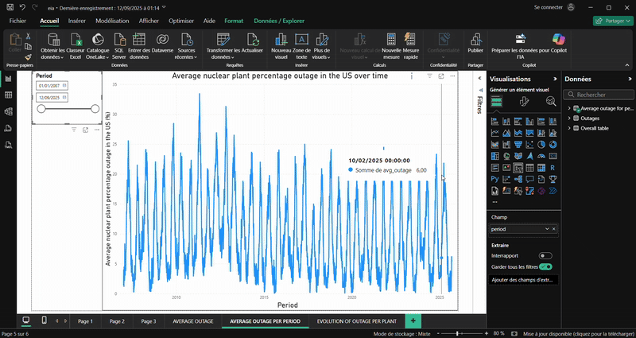
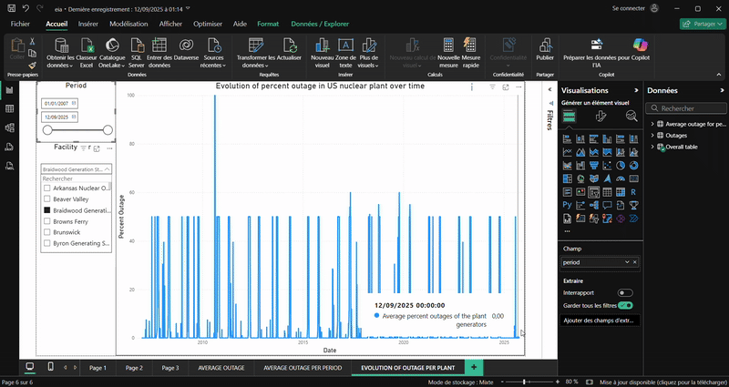

# EIA-generator-monitoring 

The goal of this project is to monitor the outages of US nuclear power plant. The data is updated daily.

We retrieve data from the EIA API thanks to Azure Function App and then we update our Azure SQL database.

## Demo 

Here is a demo of the dashboard we have on Power BI, this gif corresponds to the average outage in the US. 

The following gif correspond to the outage per location in the US. 

---

## 📂 Repository structure

- **`myTimerFunction/`**  
  Contains the main Azure Function code. This function is triggered on a schedule (timer trigger) and is responsible for:
  - Fetching data from the API
  - Cleaning and transforming it
  - Storing results in the SQL database

- **`.funcignore`**  
  Azure Functions deployment configuration.  
  Specifies files/folders to **exclude** when deploying to Azure (similar to `.gitignore` but for the Azure runtime).

- **`.gitignore`**  
  Git configuration file.  
  Specifies files/folders to **exclude** from version control (e.g., environment files, cache, logs).

- **`README.md`**  
  This file 🙂 — documentation for the repository.

- **`database_creation.ipynb`**  
  Jupyter Notebook used to create and initialize the database.  
  Contains the first version of the code for schema creation, initial testing, and early data collection logic.

- **`host.json`**  
  Global configuration for the Azure Functions runtime (e.g., logging, timeouts).
